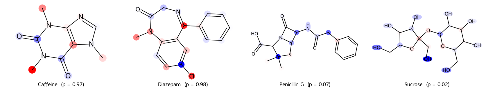

# Graph2Drug

A reproducible, cross-dataset framework for molecular property prediction built
on **D-GCAN** (Directed Graph Convolutional Attention Network). The project
reproduces D-GCAN, fixes a training bug in the original implementation, and
evaluates it under a statistically sound multi-seed protocol on four
MoleculeNet benchmarks: **BBBP, BACE, ClinTox and Tox21**.

> Status: all experiments complete (roadmap below); paper in preparation.

**Summary of findings**
1. The published D-GCAN training code has a latent loss bug: on BBBP it cannot
   learn (test AUC 0.466); a one-line fix restores learning (0.640 on BBBP,
   0.79–0.84 elsewhere). On the authors' own drug-likeness data the bug is
   harmless, so their published numbers reproduce.
2. Scaffold splits are much harder than random splits (up to +0.25 AUC for
   random on BBBP); scaffold test molecules are less similar to training data.
3. Untuned standard GNNs (GCN, GAT, GraphSAGE) beat the fixed D-GCAN on BBBP
   and match it on BACE.
4. No single D-GCAN component is essential; replacing its Weisfeiler–Lehman
   fingerprints with plain atom types *improves* BBBP (0.640 → 0.695).
5. D-GCAN's attention weights are not faithful explanations; per-atom occlusion
   and GNNExplainer are, and give chemically sensible case studies.
6. Re-running the paper's own ablation on its own data: the graph-convolution
   claim holds, the attention claim does not (no AUC difference).

---

## Key finding: the original D-GCAN classifier cannot learn on BBBP

Training the upstream D-GCAN code on BBBP (scaffold split) gave a test AUC of
**0.466** — no better than chance — with every molecule predicted positive.

Diagnostics (`experiments/train_dataset_v2.py`, `v3.py`, inference-only) traced
this to a single root cause in the upstream `DGCAN.py`:

- `mlp()` applies `torch.sigmoid()` to the classifier output, and
  `forward_classifier()` then passes that **already-squashed** output into
  `F.cross_entropy()`, which applies its own softmax/log.
- Logits grow to ±20–80 within the first few epochs, the sigmoid saturates to
  exactly 0/1, and its derivative collapses — gradients in every layer fall to
  1e-10…1e-7.
- Validation AUC freezes at 0.5 from epoch 5 onward, and the output no longer
  responds to the input (replacing a molecule with random noise changes the
  logit by < 0.1).

**Fix:** pass raw logits to `F.cross_entropy` (applied as a monkey-patch of
`forward_classifier` on the model instance; upstream code is left untouched).
Mean gradient norm improves ~4× immediately, and validation AUC rises from
0.5 to ~0.95 within a few epochs.

| BBBP (single run) | Original (bug) | Fixed |
|---|---|---|
| Test AUC | 0.4662 | **0.6523** |
| Specificity | 0.0000 | 0.2247 |
| MCC | 0.0000 | 0.1435 |
| Prediction score std | ~8e-7 (collapsed) | 0.35 |

---

## Results — multi-seed baseline (fixed D-GCAN)

Protocol, identical for every dataset: DeepChem `ScaffoldSplitter` 80/10/10
(seed 42), original D-GCAN hyperparameters, 140 epochs, best checkpoint chosen
by validation AUC, **5 training seeds (42–46), reported as mean ± std**.
Tox21 uses the single SR-MMP task; ClinTox uses `CT_TOX`.

| Dataset | Test AUC | Test PR-AUC | Balanced Acc. | MCC | Specificity |
|---|---|---|---|---|---|
| BBBP | **0.6396 ± 0.0120** | — | — | 0.1213 ± 0.0371 | 0.1798 ± 0.0381 |
| BACE | **0.7938 ± 0.0191** | 0.8161 ± 0.0186 | 0.7397 ± 0.0216 | 0.4770 ± 0.0448 | 0.7233 ± 0.0596 |
| ClinTox (CT_TOX) | **0.8419 ± 0.0285** | 0.3409 ± 0.0714 | 0.7421 ± 0.0410 | 0.3315 ± 0.0618 | 0.8642 ± 0.0340 |
| Tox21 (SR-MMP) | **0.8061 ± 0.0137** | 0.4835 ± 0.0272 | 0.7332 ± 0.0218 | 0.3944 ± 0.0384 | 0.7693 ± 0.0426 |

Notes:
- **Training is reproducible**: seed-to-seed std of test AUC (≈0.01–0.03) is
  far smaller than the test-set sampling uncertainty (BBBP bootstrap 95% CI
  width ≈ 0.16 with n = 183).
- **BBBP's valid/test gap is dataset-specific.** On BBBP the best validation
  AUC (~0.95) is far above test AUC (~0.65); test molecules are measurably
  less similar to the training set than validation molecules (mean nearest-
  neighbour Tanimoto 0.415 vs 0.472). On BACE the gap reverses (valid ~0.74,
  test ~0.79), so this is not a generic scaffold-split artefact.
- **ClinTox is highly imbalanced** (10 positives in 144 test molecules), so its
  AUC is noisy; PR-AUC 0.34 is ~5× the 7% positive rate.
- **Tox21 (SR-MMP) is imbalanced too** (19% positives in 563 test molecules);
  PR-AUC 0.48 is ~2.5× the positive rate.
- A dropout / weight-decay sweep (`train_dataset_v7.py`) found no robust
  improvement over the original hyperparameters.

---

## Random vs. scaffold split

Same molecules, same split sizes, only the assignment changes
(`prepare_random_split.py`, `train_dataset_v10.py`); similarity = mean Tanimoto
(ECFP4) of each test molecule to its nearest training molecule
(`train_dataset_v11.py`). Table: `results/split_comparison_v10.csv`.

| Dataset | Scaffold AUC | Random AUC | Δ (Welch p) | Test→train similarity (scaffold / random) |
|---|---|---|---|---|
| BBBP | 0.640 ± 0.012 | 0.887 ± 0.011 | +0.247 (<1e-4) | 0.415 / 0.576 |
| BACE | 0.794 ± 0.019 | 0.880 ± 0.006 | +0.086 (3e-4) | 0.565 / 0.793 |
| ClinTox | 0.842 ± 0.029 | 0.783 ± 0.026 | −0.059 (0.009) | 0.359 / 0.483 |
| Tox21 | 0.806 ± 0.014 | 0.909 ± 0.015 | +0.103 (<1e-4) | 0.406 / 0.572 |

Scaffold test sets are less similar to training on every dataset, and the random
split scores higher on 3 of 4. ClinTox reverses, plausibly because it has very
few positives (10–15 per test set) and clinical-toxicity labels depend on more
than structure.

## Architecture comparison

GCN / GAT / GraphSAGE baselines (`train_dataset_v12.py`, PyTorch Geometric,
standard untuned settings) on the identical scaffold splits and protocol.
Table: `results/architecture_comparison_v12.csv`.

| Model | BBBP AUC (p vs D-GCAN) | BACE AUC (p vs D-GCAN) |
|---|---|---|
| D-GCAN (fixed) | 0.640 ± 0.012 | 0.794 ± 0.019 |
| GCN | 0.701 ± 0.043 (0.031) | 0.819 ± 0.012 (0.044) |
| GAT | 0.680 ± 0.019 (0.006) | 0.811 ± 0.011 (0.136) |
| GraphSAGE | 0.692 ± 0.007 (0.0001) | 0.797 ± 0.012 (0.742) |

## Ablations

Each variant removes one D-GCAN component (`train_dataset_v13.py`).
Table: `results/ablation_v13.csv`.

| Variant | BBBP AUC (p vs full) | BACE AUC (p vs full) |
|---|---|---|
| Full D-GCAN | 0.640 ± 0.012 | 0.794 ± 0.019 |
| no GCN layers | 0.667 ± 0.019 (0.033) | 0.774 ± 0.039 (0.355) |
| no GAT block | 0.656 ± 0.017 (0.127) | 0.787 ± 0.026 (0.630) |
| uniform attention | 0.636 ± 0.013 (0.642) | 0.784 ± 0.022 (0.484) |
| atom types instead of WL fingerprints | **0.695 ± 0.013 (1e-4)** | 0.811 ± 0.014 (0.147) |

"no GAT block" and "uniform attention" ran on CPU (free GPU quota exhausted);
a CPU/GPU check on the same variant agreed within seed spread.

## Explainability

Per-atom occlusion, GNNExplainer (node-mask variant) and GAT attention for the
trained BBBP / BACE models (`train_dataset_v14.py`, `v17.py`). Faithfulness test:
delete each method's top-3 atoms and compare the change in prediction with
deleting 3 random atoms. Scaffold enrichment: share of the top-3 atoms on the
Murcko scaffold relative to the scaffold's share of the molecule (1 = no
preference).

| | BBBP mean \|Δp\| | beats random | scaffold enr. | BACE mean \|Δp\| | beats random | scaffold enr. |
|---|---|---|---|---|---|---|
| Occlusion | 0.175 | 86% | 0.96 | 0.298 | 89% | 1.00 |
| GNNExplainer | 0.101 | 58% | 1.02 | 0.167 | 72% | 1.06 |
| GAT attention | 0.058 | 64% | 0.46 | 0.048 | 26% | 0.29 |
| Random 3 atoms | 0.040 | — | — | 0.062 | — | — |



Red atoms support the positive prediction, blue oppose it: e.g. sucrose's
hydroxyl groups argue against blood–brain barrier penetration, and diazepam's
chlorine for it.

---

## Re-testing the original paper on its own data

The D-GCAN paper (Sun et al., *Bioinformatics* 2022) reported drug-likeness
results (FDA drugs vs. ZINC) from one random split and a single run, with no
validation set, and an "AUC" computed from 0/1 predicted labels.

**Authors' exact protocol, original vs. fixed code** (`train_dataset_v15.py`;
their `data_train`/`data_test`, last-epoch model, seeds 0/42/43):

| Code | Accuracy | Hard-label "AUC" | Score AUC |
|---|---|---|---|
| Original (bug) | 0.900 ± 0.008 | 0.900 | 0.942 ± 0.010 |
| Fixed | 0.906 ± 0.008 | 0.906 | 0.960 ± 0.002 |

(paper: accuracy 0.923, "AUC" 0.951). The bug does not break training on this
balanced dataset — it is a latent, dataset-dependent defect.

**The paper's ablation, with a validation set and 3 seeds**
(`prepare_druglike_splits.py`, `train_dataset_v16.py`; 4266 unique molecules,
random and balanced scaffold 80/10/10 splits; Welch p vs. the full model):

| Variant (paper's name) | Random split AUC | Scaffold split AUC |
|---|---|---|
| Full D-GCAN | 0.951 ± 0.007 | 0.943 ± 0.002 |
| No attention ("GCNN") | 0.952 ± 0.005 (p = 0.95) | 0.931 ± 0.010 (p = 0.16) |
| No graph convolution ("GAT") | 0.918 ± 0.007 (p = 0.004) | pending |

The paper credits graph convolution with +6.1% accuracy and attention with
+4.0%. On its own data the convolution claim is supported; the attention claim
is not — AUC is unchanged, and the accuracy gap (0.872 vs. 0.840 at the 0.15
threshold, p = 0.40) reverses at a 0.5 threshold. The standard largest-first
scaffold split is degenerate on this dataset (validation and test end up 100%
drugs, because the ZINC molecules share a few large scaffolds), so a balanced
scaffold split is used. Occlusion and GNNExplainer show no atom-level scaffold
preference on these models (enrichment ≈ 1.0).

Results: `results/druglike_v15_runs.csv`, `results/paper_ablation_v16.csv`,
`results/explain_v17_*`.

---

## Demo: predict a molecule

Web app (runs locally): `streamlit run app.py` → http://localhost:8501

```bash
python experiments/demo_predict.py --dataset BBBP --smiles "CN1C=NC2=C1C(=O)N(C(=O)N2C)C"   # caffeine
python experiments/demo_predict.py --dataset BBBP --verify    # reproduces the reported test AUC
```

Loads a trained checkpoint and predicts on CPU in ~10 s (`--dataset BBBP` or `BACE`).
See [DEMO.md](DEMO.md) for a full walkthrough.

---

## Repository layout

```
datasets/
  raw/          MoleculeNet CSVs (BBBP, BACE, ClinTox, Tox21)
  processed/    cleaned data + scaffold splits ({DATASET}_train/valid/test.txt)
                random/ — random splits of the same molecules
                druglike{Random,Scaffold}_* — splits of the D-GCAN authors' data
experiments/
  prepare_dataset.py   cleaning + scaffold split for BACE / ClinTox / Tox21
  train_dataset_v1.py  original pipeline (reproduces the bug; frozen baseline)
  train_dataset_v2.py  diagnostics: saturated prediction scores
  train_dataset_v3.py  root-cause diagnostics (logits, gradients, perturbation)
  train_dataset_v4.py  fix + 10-epoch smoke test (CPU)
  train_dataset_v5.py  fix + full 140-epoch run (Colab GPU)
  train_dataset_v6.py  valid/test AUC gap investigation (bootstrap, novelty)
  train_dataset_v7.py  dropout / weight-decay sweep
  train_dataset_v8.py  5-seed BBBP baseline (official BBBP number)
  train_dataset_v9.py  5-seed baseline for BACE / ClinTox / Tox21
  prepare_random_split.py  random split with the same molecules and sizes
  train_dataset_v10.py random-split runs (all four datasets)
  train_dataset_v11.py train/test structural similarity, both splits
  train_dataset_v12.py GCN / GAT / GraphSAGE baselines (PyTorch Geometric)
  train_dataset_v13.py D-GCAN ablations
  train_dataset_v14.py explainability: occlusion vs attention, case studies
  train_dataset_v15.py authors' drug-likeness protocol, original vs fixed code
  prepare_druglike_splits.py  random + balanced scaffold splits of the authors' data
  train_dataset_v16.py the paper's ablation on its own data
  train_dataset_v17.py GNNExplainer, faithfulness and scaffold enrichment
  demo_predict.py      predict any SMILES with a trained checkpoint (CPU)
models/         trained checkpoints (.pth)
results/        per-run CSVs, training logs, predictions and diagnostic plots
notebooks/      exploratory notebooks
Phase1/, Phase2/  earlier exploratory runs (not part of the reported results)
```

Each `train_dataset_vN.py` adds a capability without modifying earlier
versions, so every reported number can be traced to the script that produced
it.

---

## Reproducing

Requirements: Python 3.10+, `torch`, `rdkit`, `pandas`, `scikit-learn`,
`matplotlib`, `scipy`, `torch_geometric` (v12 only), `streamlit` (app only);
`deepchem` (+ `tensorflow`) only for `prepare_dataset.py`.

```bash
pip install -r requirements.txt
git clone https://github.com/JinYSun/D-GCAN.git vendor/D-GCAN   # upstream model code
```

- Local scripts (`prepare_dataset.py`, `v2`, `v3`, `v4`, `v6`) use paths
  relative to the repo and import D-GCAN from `vendor/D-GCAN/DGCAN`. On a
  machine without CUDA, set `preprocess.device = torch.device('cpu')` after
  import (upstream hard-codes `cuda`).
- GPU scripts (`v5`, `v7`–`v10`, `v13`, `v15`, `v16`) are written for a Colab VM
  (`/content/...` paths) and clone the upstream repo automatically. Set
  `DATASET_OVERRIDE = "BACE"` (and for v13/v16 optionally `ABLATIONS_OVERRIDE`) in
  the kernel first. v12–v14 and v17 also run locally (v12, v14 and v17 on CPU in minutes).
- `utils/colab/refresh_token.py` renews the Colab CLI's 1-hour proxy token for
  long runs.
- `v1` (and the earlier drafts `train_dataset.py`, `train_bbbp.py`) are the
  original Colab notebooks' code, kept unchanged for reference; they expect the
  project on a mounted Google Drive at `/content/drive/MyDrive/DGCAN_Project`.

A full 5-seed run takes ~34 min (BBBP), ~41 min (BACE), ~30 min (ClinTox) and ~79 min (Tox21)
on a T4 GPU.

---

## Roadmap

- [x] Diagnose and fix the D-GCAN training bug
- [x] Multi-seed BBBP baseline
- [x] BACE, ClinTox multi-seed baselines
- [x] Tox21 (SR-MMP) multi-seed baseline
- [x] Random vs. scaffold split comparison (all four datasets)
- [x] Architecture comparison (GCN / GAT / GraphSAGE / D-GCAN; BBBP, BACE)
- [x] Ablations (GCN, GAT, fingerprint and attention components; BBBP, BACE)
- [x] Explainability (occlusion vs. attention, case studies; BBBP, BACE)
- [x] GNNExplainer + scaffold-shortcut analysis
- [x] Original paper re-tested on its own data (protocol + ablation)
- [ ] Ablation: no graph convolution, scaffold split (one GPU run)
- [ ] Paper write-up

---

## Acknowledgements

The model architecture and original training code are from **D-GCAN** by
Jinyu Sun et al. — https://github.com/JinYSun/D-GCAN (BSD 3-Clause License).
This repository does not redistribute that code; it is cloned at run time.
Datasets are from [MoleculeNet](https://moleculenet.org/).
